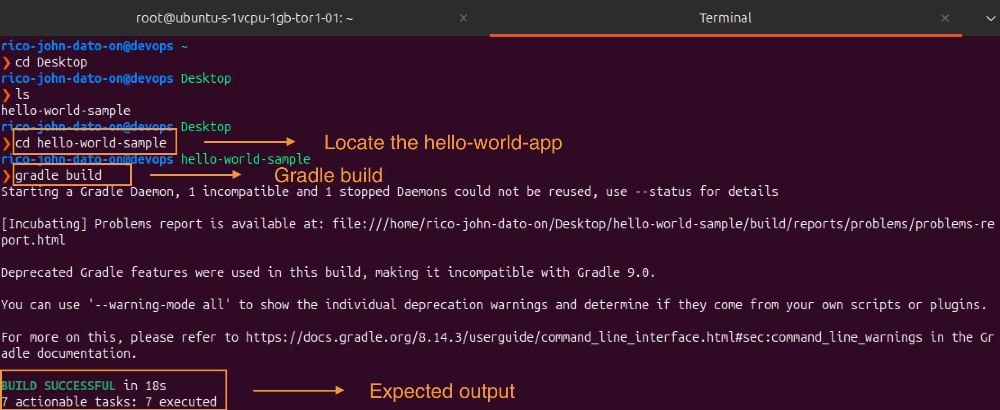
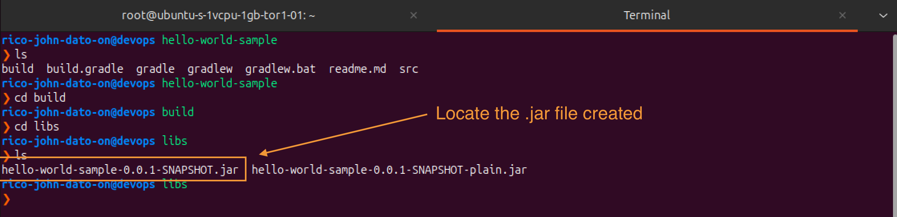
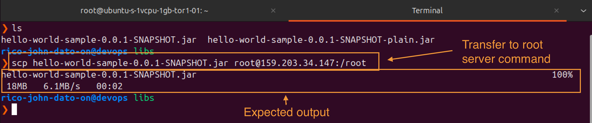
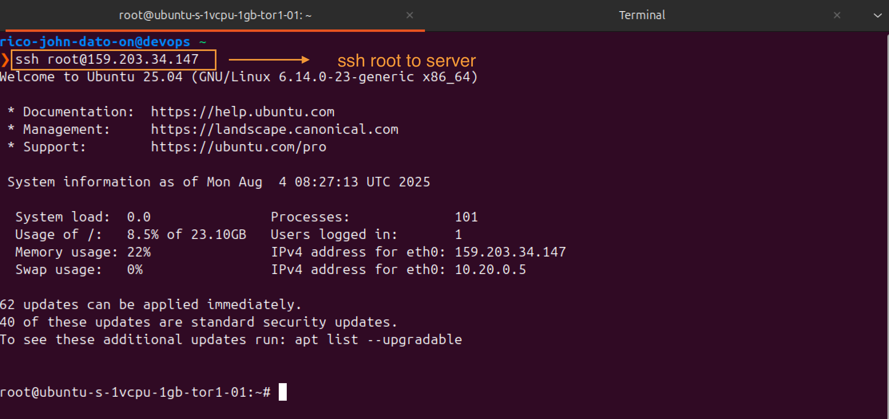
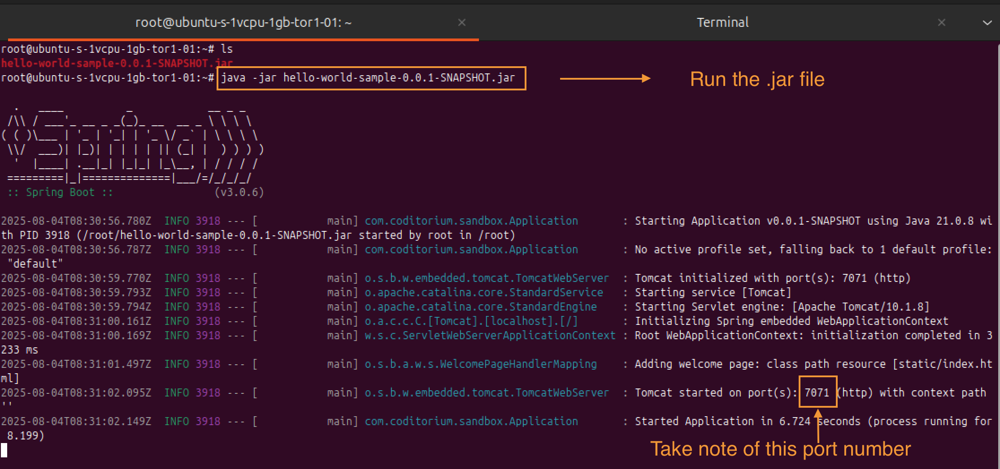
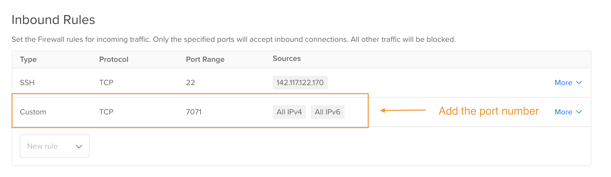
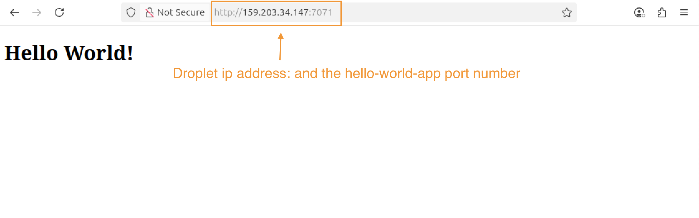
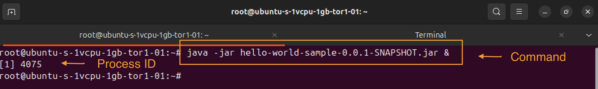
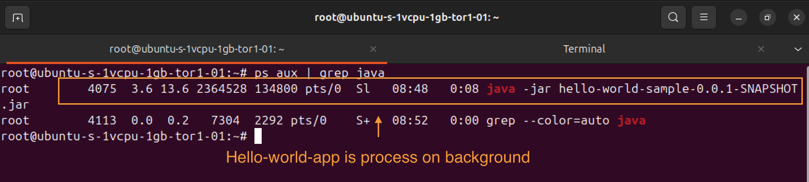
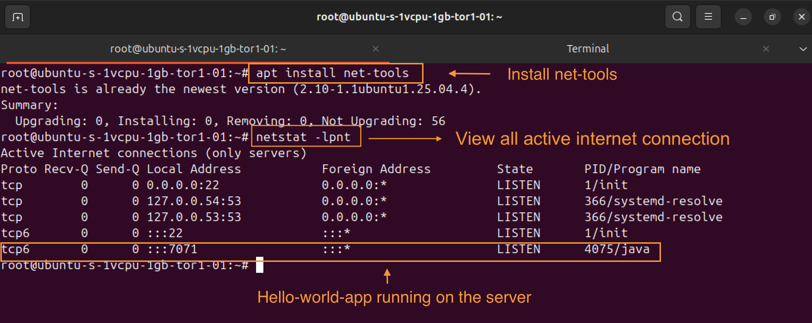

# 🌐 Sample Hello-World Deployment in Digital Ocean

## 🚀 Overview

This guide walks you through deploying a simple java app on a remote Ubuntu server (e.g., DigitalOcean). You'll build a `.jar` file locally and deploy it using secure copy (`scp`), then access it via your browser.

---

## 🛠 Prerequisites

- Java installed on both local and remote machines
- Gradle installed locally
- Access to a remote server (e.g., DigitalOcean Droplet)
- SCP (Secure Copy) available in your terminal

---

## 📦 Build the Application Locally

1. **Build a `.jar` File - for Hello World App**

```bash
gradle build
```



2. **Locate the `.jar` File - of our Hello World App - Gradle**

After build, navigate to:

```
build/libs/your-app-name.jar
```



---

## 📤 Transfer to Remote Server

Use `scp` to copy the `.jar` file to the remote server:

```bash
scp your-app-name.jar root@<your-server-ip>:/root
```



---

## 🖥 Run the Application on Server

1. **SSH into Server**

```bash
ssh root@<your-server-ip>
```



2. **Run the Application**

```bash
java -jar your-app-name.jar
```



---

## 🌍 Access in Browser

1. **Open Firewall Port**

In DigitalOcean firewall settings:

- Add rule: **Custom TCP**
- Port: `7071`
- Source: **All sources**



2. **Open in Browser**

```url
http://<your-server-ip>:7071
```



---

## 🧰 Useful Server Commands

- **Run in Background**

```bash
java -jar your-app-name.jar &
```



- **Check if App is Running**

```bash
ps aux | grep java
```



- **Install Netstat to show the applications that has active internet connections**

```bash
apt install net-tools
```

- **Check Listening Ports**

```bash
netstat -lpnt
```



---

## 📋 Summary

- Clone → Build → Transfer → Run → Access via Browser ✅
- Use firewall rules to expose ports 🌐
- Monitor processes & ports for application health 📈

---

## 📎 Resources

- [Gradle Documentation](https://docs.gradle.org)
- [DigitalOcean Guides](https://www.digitalocean.com/docs)
- [Java Downloads](https://www.java.com/en/download/)

🧑‍💻 _Created by Rico John Dato-on_
🔗 [LinkedIn](https://www.linkedin.com/in/rico-john-dato-on) • [Portfolio](https://ricodatoon.netlify.app)
